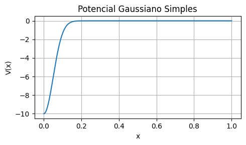
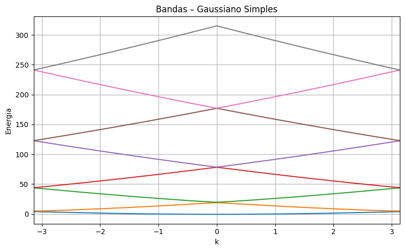
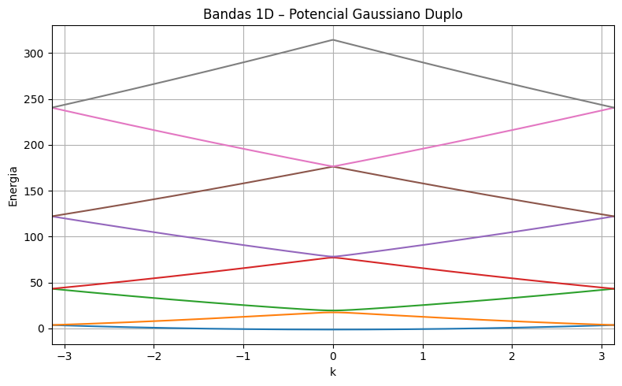

# Bandas de Energia em um Cristal 1D: Comparação entre Modelos de Potencial

Este projeto simula e compara as bandas de energia em um cristal unidimensional usando dois modelos:

- **Modelo quase-livre**: aproxima o potencial periódico por um termo constante α nas diagonais vizinhas da matriz Hamiltoniana.  
- **Modelo com potencial real**: calcula a matriz do potencial \( V_{m,n} \) a partir da transformada de Fourier de um potencial gaussiano \( V(x) \), e monta o Hamiltoniano completo.

## Objetivo

Investigar como diferentes representações do potencial periódico afetam as bandas de energia de elétrons em um cristal 1D.

## Visualização das Figuras

Abaixo estão os gráficos gerados a partir da simulação de bandas de energia em um cristal unidimensional com diferentes potenciais periódicos.

### 1. Potencial Gaussiano Simples

  
Representa um potencial suave e localizado, centrado na origem.

### 2. Bandas – Gaussiano Simples

  
Mostra a estrutura de bandas resultante do potencial gaussiano simples. Gaps começam a surgir entre os níveis de energia.

### 3. Potencial Gaussiano Duplo

  
Dois picos gaussianos simétricos formam um potencial periódico mais elaborado.

### 4. Bandas – Gaussiano Duplo

  
Bandas mais complexas, com múltiplos gaps, causados pela maior simetria do potencial.

### 5. Modelo Tridiagonal com Alpha Constante

  
Bandas obtidas com um modelo tridiagonal simples usando potencial constante \( \alpha \). Imita o comportamento de elétrons quase-livres.

### 6. Bandas 1D com Potencial Real (Fourier)

  
Cálculo completo com potencial gaussiano duplo via matriz de Fourier. Mostra claramente a formação das bandas e lacunas de energia.

